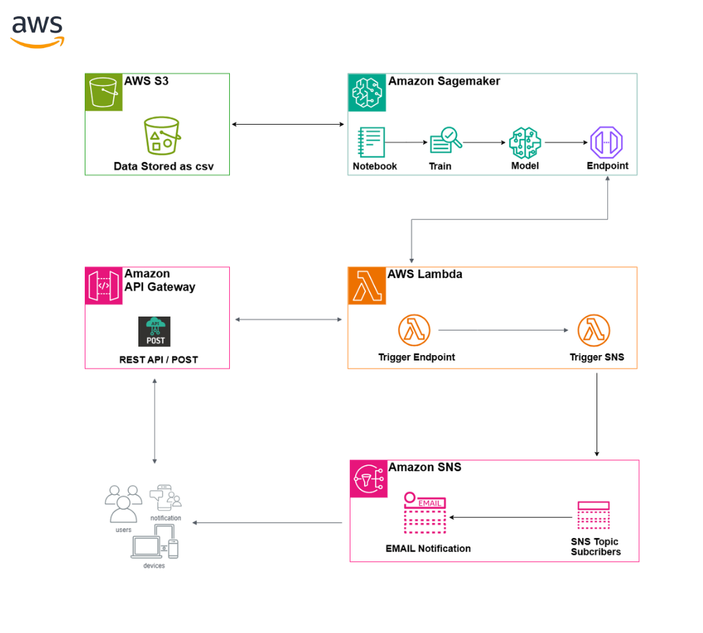
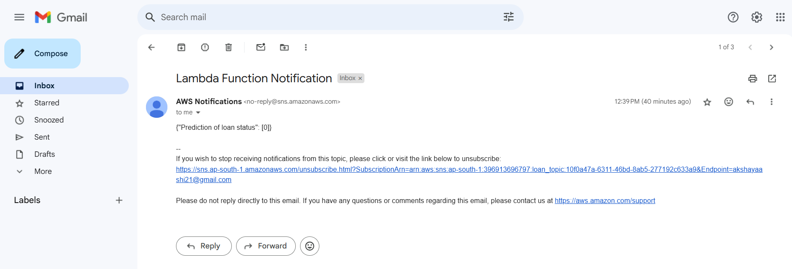

# AWS_ML_real-time_prediction
 This project showcases an AWS-driven architecture for deploying a machine learning model using the Random Forest algorithm to predict loan approval outcomes (approved or rejected)

 # Architecture

1) AWS S3: Stores input data as CSV files, which are used for training the machine learning model.

2) Amazon SageMaker:

     * Hosts Jupyter notebooks for preprocessing and model training.

     * Trains the Random Forest model and deploys it to an endpoint for real-time predictions.

3) Amazon API Gateway: Provides a RESTful interface for external applications to interact with the model endpoint.

4) AWS Lambda:

     * Handles API Gateway requests.

     * Triggers the SageMaker endpoint for predictions.

     * Sends notifications via Amazon SNS.

5) Amazon SNS:

     * Sends email notifications to subscribed users.

     * Manages topic subscriptions for scalable notifications.
  
# Workflow

1) Data is uploaded to AWS S3 in CSV format.

2) Amazon SageMaker processes the data, trains the Random Forest model, and deploys an endpoint.

3) API Gateway triggers an AWS Lambda function to process the request.

4) Lambda function calls the SageMaker endpoint for loan status predictions and sends notifications through Amazon SNS.

5) Users subscribed to the SNS topic receive email notifications with the prediction results

# Output

# Key Features

* Scalable Deployment: Leverages AWS services for seamless scaling.

* Real-Time Predictions: API Gateway and Lambda enable instant loan status inference.

* Notification System: SNS ensures timely updates to users.
  

# Prerequisites

To replicate or deploy this system, ensure you have:

1) An AWS account.

2) IAM roles with appropriate permissions for S3, SageMaker, Lambda, API Gateway, and SNS.

3) Data in CSV format ready for upload.

 
